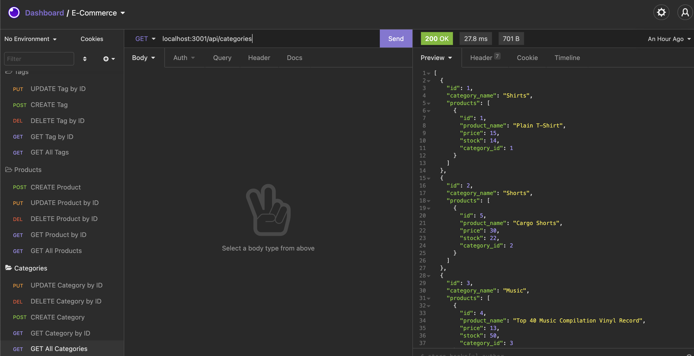
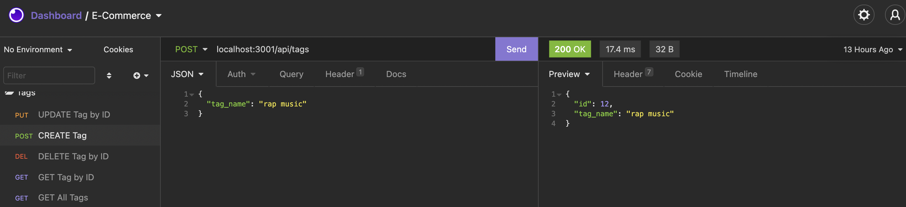
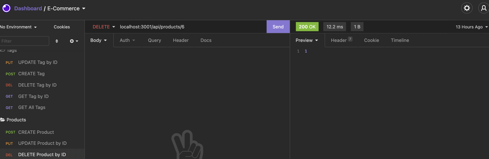
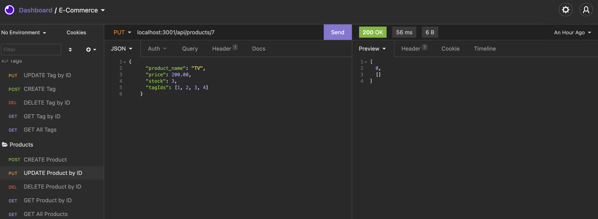

# E-Commerce Back End

  

  ## Description
  Management of an e-commerce company can keep track of business from the back end using Sequelize, Node.js, Express and Dotenv.

  ## Table of Contents
  * [Installation](#installation)
  * [Usage](#usage)
  * [Credits](#credits)
  * [License](#license)
  * [Contact](#contact)

  ## Installation
  Clone repository. Run "npm install" in the command line. Check dependencies to make sure the following packages are installed: dotenv, express, mysql2, and sequelize. If not, run "npm i package_name" to do so. 

  ## Usage
  Run "npm start" from the command line to begin the server. Use Insomnia or another route testing program to view, create, delete and update products, categories, and tags.

  
  
  
  

  View video to connect database to server and seed data [here](https://watch.screencastify.com/v/NRtmlgc5R9yoseqao6FG) and the working of routes[here.](https://watch.screencastify.com/v/eZvDfYp99tAuZc6sk4zR)
  ## Credits
  Contributors to the project: Starter code provided by Georgia Institute of Technology

  ## License
  License for this project: [MIT License](https://choosealicense.com/licenses/mit/)

  ## Contact
  With any questions or concerns, please contact me via GitHub at [cianfich1016](https://github.com/cianfich1016) or by email at cianfich@gmail.com.

